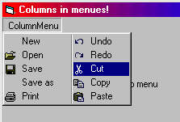



## Columns in Menues\! Look at the Screenshot\!

### Description

This code creates a column menue from a normal menue with a free selectable number of items in one column.

This works also with bitmaps in the menue.

Useful when you have menues that are too large for normal VisualBasic appearance. Enjoy! AND VOTE FOR ME!
 
### More Info
 

             |
---                |---
**Submitted On**   |2000-09-06 15:21:00
**By**             |[Druid Developing](https://github.com/Planet-Source-Code/PSCIndex/blob/master/ByAuthor/druid-developing.md)
**Level**          |Intermediate
**User Rating**    |4.8 (19 globes from 4 users)
**Compatibility**  |VB 5\.0, VB 6\.0
**Category**       |[Custom Controls/ Forms/  Menus](https://github.com/Planet-Source-Code/PSCIndex/blob/master/ByCategory/custom-controls-forms-menus__1-4.md)
**World**          |[Visual Basic](https://github.com/Planet-Source-Code/PSCIndex/blob/master/ByWorld/visual-basic.md)
**Archive File**   |[CODE\_UPLOAD9676962000\.zip](https://github.com/Planet-Source-Code/druid-developing-columns-in-menues-look-at-the-screenshot__1-11295/archive/master.zip)

### API Declarations

Some.

